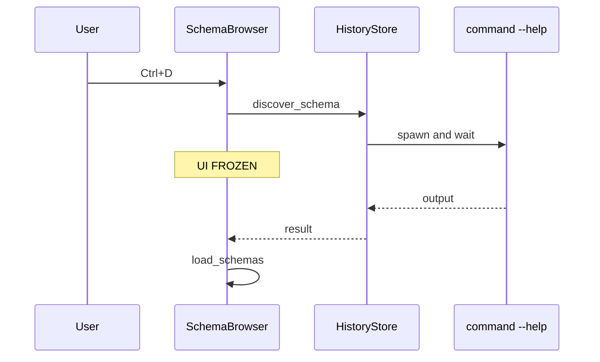
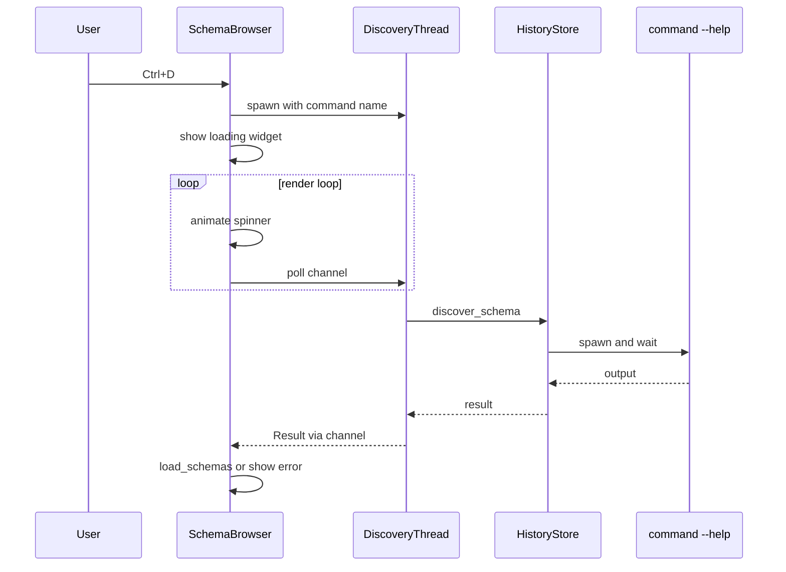
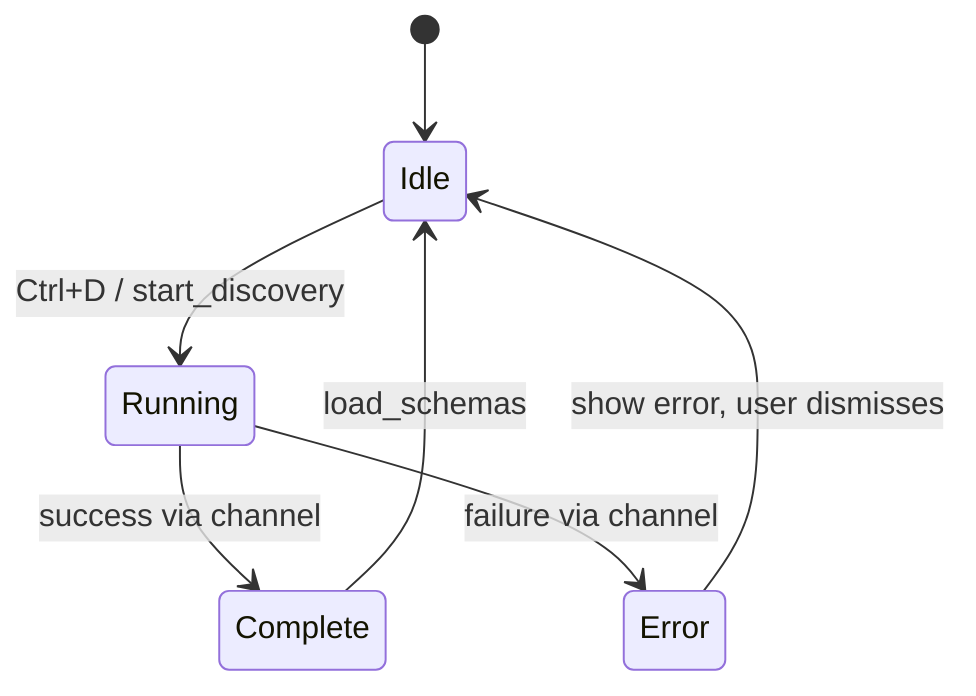

# Loading Widget and Thread-Based Discovery Architecture

## Overview

This document describes the design for adding an animated loading widget to the chrome UI widget library and moving the command-schema discovery operation to a background thread. This enables the UI to animate during discovery, which can be slow since it runs `command --help` externally.

## Current State Analysis

### Blocking Flow (Current)



### Target Flow (Proposed)



---

## 1. LoadingWidget API Design

### Struct Definition

```rust
// src/ui/loading_widget.rs

use ratatui_core::buffer::Buffer;
use ratatui_core::layout::Rect;
use ratatui_core::style::{Modifier, Style};
use ratatui_core::text::{Line, Span};
use ratatui_core::widgets::Widget;

use crate::chrome::theme::Theme;

/// Animation frame style for the loading spinner.
#[derive(Debug, Clone, Copy, Default)]
pub enum SpinnerStyle {
    /// ASCII-safe spinner: `-, \, |, /`
    Ascii,
    /// Unicode block segments that appear to rotate.
    #[default]
    Block,
    /// Braille pinwheel patterns.
    Braille,
    /// Dots that cycle through fill states.
    Dots,
    /// Moon phases.
    Moon,
}

/// Configuration for loading widget animation.
#[derive(Debug, Clone)]
pub struct LoadingConfig {
    /// Animation frame style.
    pub style: SpinnerStyle,
    /// Ticks between frame advances. Default: 1 (animate every render).
    pub tick_interval: u8,
    /// Optional label text displayed after the spinner.
    pub label: Option<String>,
}

impl Default for LoadingConfig {
    fn default() -> Self {
        Self {
            style: SpinnerStyle::default(),
            tick_interval: 1,
            label: None,
        }
    }
}

/// Animated loading indicator widget.
pub struct LoadingWidget {
    /// Current frame index.
    frame: usize,
    /// Tick counter for rate-limiting animation.
    tick: u8,
    /// Configuration.
    config: LoadingConfig,
}

impl LoadingWidget {
    /// Creates a new loading widget with default configuration.
    pub fn new() -> Self {
        Self {
            frame: 0,
            tick: 0,
            config: LoadingConfig::default(),
        }
    }

    /// Creates a loading widget with a label.
    pub fn with_label(label: impl Into<String>) -> Self {
        let mut widget = Self::new();
        widget.config.label = Some(label.into());
        widget
    }

    /// Sets the spinner style.
    pub fn set_style(&mut self, style: SpinnerStyle) {
        self.config.style = style;
    }

    /// Sets the tick interval for animation speed control.
    pub fn set_tick_interval(&mut self, interval: u8) {
        self.config.tick_interval = interval.max(1);
    }

    /// Advances the animation by one tick.
    /// Call this once per render loop iteration.
    pub fn tick(&mut self) {
        self.tick += 1;
        if self.tick >= self.config.tick_interval {
            self.tick = 0;
            self.frame = (self.frame + 1) % self.config.style.frame_count();
        }
    }

    /// Returns the current spinner character.
    pub fn current_char(&self) -> char {
        self.config.style.char_at(self.frame)
    }

    /// Renders the widget to a buffer area.
    pub fn render(&self, buffer: &mut Buffer, area: Rect, theme: &Theme) {
        if area.width == 0 || area.height == 0 {
            return;
        }

        let spinner = self.current_char();
        let style = Style::default()
            .fg(theme.semantic_info)
            .add_modifier(Modifier::BOLD);

        let spans = if let Some(ref label) = self.config.label {
            vec![
                Span::styled(spinner.to_string(), style),
                Span::raw(" "),
                Span::styled(label.clone(), Style::default().fg(theme.text_primary)),
            ]
        } else {
            vec![Span::styled(spinner.to_string(), style)]
        };

        ratatui_widgets::paragraph::Paragraph::new(Line::from(spans)).render(area, buffer);
    }
}
```

### Animation Frame Styles

```rust
impl SpinnerStyle {
    /// Returns the number of frames in this animation.
    pub fn frame_count(&self) -> usize {
        match self {
            SpinnerStyle::Ascii => 4,
            SpinnerStyle::Block => 8,
            SpinnerStyle::Braille => 6,
            SpinnerStyle::Dots => 4,
            SpinnerStyle::Moon => 8,
        }
    }

    /// Returns the character at the given frame index.
    pub fn char_at(&self, frame: usize) -> char {
        let idx = frame % self.frame_count();
        match self {
            SpinnerStyle::Ascii => ['-', '\\', '|', '/'][idx],
            SpinnerStyle::Block => ['▏', '▎', '▍', '▌', '▋', '▊', '▉', '█'][idx],
            SpinnerStyle::Braille => ['⡿', '⣟', '⣯', '⣷', '⣾', '⣽'][idx],
            SpinnerStyle::Dots => ['⠁', '⠃', '⠇', '⡇'][idx],
            SpinnerStyle::Moon => ['🌑', '🌒', '🌓', '🌔', '🌕', '🌖', '🌗', '🌘'][idx],
        }
    }
}
```

### Frame Style Visual Reference

| Style | Frame Sequence | Description |
|-------|---------------|-------------|
| **Ascii** | `- \ | /` | Classic spinner, works everywhere |
| **Block** | `▏ ▎ ▍ ▌ ▋ ▊ ▉ █` | Vertical block segments using existing `ProgressGlyphs.bar` |
| **Braille** | `⡿ ⣟ ⣯ ⣷ ⣾ ⣽` | Rotating braille pinwheel |
| **Dots** | `⠁ ⠃ ⠇ ⡇` | Growing vertical dots |
| **Moon** | `🌑🌒🌓🌔🌕🌖🌗🌘` | Moon phases (requires emoji support) |

---

## 2. Animation State Management

### Tick-Based Animation

The widget uses tick-based rather than time-based animation for simplicity:

- **tick()** is called once per render loop iteration
- **tick_interval** controls animation speed (default: 1 = every render)
- Higher interval = slower animation (e.g., interval 2 = every other render)

### Integration with Main Render Loop

```rust
// In SchemaBrowserPanel or containing panel

fn render(&mut self, buffer: &mut Buffer, area: Rect) {
    if let Some(ref mut loading) = self.loading_widget {
        loading.tick(); // Advance animation
        loading.render(buffer, loading_area, self.theme);
        return; // Don't render normal content while loading
    }
    // ... normal rendering
}
```

### Time-Based Alternative (Future)

If smoother animation is needed, the widget could track `Instant::now()`:

```rust
pub struct LoadingWidget {
    frame: usize,
    last_advance: Instant,
    interval_ms: u64, // e.g., 80ms per frame
}

impl LoadingWidget {
    pub fn tick(&mut self) {
        let now = Instant::now();
        if now.duration_since(self.last_advance).as_millis() >= self.interval_ms as u128 {
            self.frame = (self.frame + 1) % self.config.style.frame_count();
            self.last_advance = now;
        }
    }
}
```

---

## 3. Thread-Based Discovery Architecture

### Discovery State Machine



### Channel Types

```rust
use std::sync::mpsc::{self, Receiver, Sender};
use std::thread::{self, JoinHandle};

/// Result of a schema discovery operation.
#[derive(Debug)]
pub enum DiscoveryResult {
    /// Discovery succeeded with the command name.
    Success { command: String },
    /// Discovery failed with an error message.
    Error { command: String, message: String },
}

/// Handle for tracking an in-flight discovery operation.
pub struct DiscoveryHandle {
    /// Channel to receive the result when ready.
    receiver: Receiver<DiscoveryResult>,
    /// Shutdown signal for cooperative thread termination.
    shutdown_tx: Sender<()>,
    /// Completion signal emitted when the worker thread exits.
    done_rx: Receiver<()>,
    /// Thread handle for cleanup on drop.
    thread_handle: Option<JoinHandle<()>>,
}

impl DiscoveryHandle {
    /// Checks if the discovery has completed.
    /// Returns Some(result) if complete, None if still running.
    pub fn poll(&self) -> Option<DiscoveryResult> {
        match self.receiver.try_recv() {
            Ok(result) => Some(result),
            Err(mpsc::TryRecvError::Empty) => None,
            Err(mpsc::TryRecvError::Disconnected) => {
                // Thread panicked or finished without sending
                Some(DiscoveryResult::Error {
                    command: String::new(),
                    message: "Discovery thread terminated unexpectedly".to_string(),
                })
            }
        }
    }
}

impl Drop for DiscoveryHandle {
    fn drop(&mut self) {
        let _ = self.shutdown_tx.send(());

        if let Some(handle) = self.thread_handle.take() {
            if self.done_rx.recv_timeout(Duration::from_millis(100)).is_ok() {
                let _ = handle.join();
            }
        }
    }
}
```

### Thread-Safe HistoryStore Access

The challenge: `HistoryStore` is behind `Arc<Mutex<HistoryStore>>`, and we need to access it from the discovery thread.

**Option A: Pass Arc Clone to Thread**

```rust
impl SchemaBrowserPanel {
    fn start_discovery(&mut self, command: String) {
        let store = match self.history_store.clone() {
            Some(s) => s,
            None => return,
        };

        let (tx, rx) = mpsc::channel();
        let cmd_for_thread = command.clone();

        let handle = thread::spawn(move || {
            let result = {
                let mut guard = match store.lock() {
                    Ok(g) => g,
                    Err(_) => {
                        let _ = tx.send(DiscoveryResult::Error {
                            command: cmd_for_thread,
                            message: "Failed to acquire history store lock".to_string(),
                        });
                        return;
                    }
                };

                match guard.discover_schema(&cmd_for_thread) {
                    Ok(()) => DiscoveryResult::Success {
                        command: cmd_for_thread,
                    },
                    Err(e) => DiscoveryResult::Error {
                        command: cmd_for_thread,
                        message: e.to_string(),
                    },
                }
            };
            let _ = tx.send(result);
        });

        self.discovery = Some(DiscoveryHandle {
            receiver: rx,
            thread_handle: Some(handle),
        });
        self.loading_widget = Some(LoadingWidget::with_label("Discovering schema..."));
    }
}
```

**Option B: Dedicated Discovery Method on HistoryStore**

Add a thread-safe method to `HistoryStore` that returns immediately and sends result via channel:

```rust
impl HistoryStore {
    /// Starts schema discovery in a background thread.
    /// Returns immediately; result sent via the provided sender.
    pub fn discover_schema_async(
        &mut self,
        command: &str,
        tx: Sender<DiscoveryResult>,
    ) {
        // This would require internal refactoring to not need &mut self
        // which is complex. Option A is simpler.
    }
}
```

**Recommendation**: Use Option A (pass Arc clone to thread). It's simpler and requires no changes to `HistoryStore`.

### Polling in Main Loop

```rust
impl SchemaBrowserPanel {
    /// Call this from the main event loop or render cycle.
    pub fn poll_discovery(&mut self) {
        let Some(handle) = self.discovery.as_ref() else {
            return;
        };

        if let Some(result) = handle.poll() {
            self.loading_widget = None;
            self.discovery = None;

            match result {
                DiscoveryResult::Success { command } => {
                    self.load_schemas();
                    self.status = Some(format!("Discovered: {}", command));
                }
                DiscoveryResult::Error { command, message } => {
                    self.status = Some(format!("Discovery failed [{}]: {}", command, message));
                }
            }
        }
    }
}
```

### Thread Safety Considerations

1. **Mutex Contention**: The discovery thread holds the `HistoryStore` mutex during discovery. This blocks other panels from accessing it. Consider:
   - Acceptable for short operations
   - If discovery is long, consider releasing mutex during `--help` execution

2. **Panic Handling**: The discovery thread could panic. The `poll()` method handles `Disconnected` as an error.

3. **Cancellation**: If user navigates away during discovery, the `DiscoveryHandle` drop cleans up the thread.

---

## 4. Error Display Design

### Option A: Inline Status (Recommended)

Use the existing `status` field in `SchemaBrowserPanel`:

```rust
// Already exists in schema_browser.rs
status: Option<String>,

// Displayed via border_info() in render
```

**Pros**: Minimal changes, consistent with existing patterns
**Cons**: Limited visibility, easy to miss

### Option B: Chrome Notification System

Use the existing notification system in `Chrome`:

```rust
// In SchemaBrowserPanel, after discovery error:
if let Some(chrome) = &self.chrome {
    chrome.notify(
        format!("Discovery failed: {}", message),
        NotificationStyle::Error,
        Duration::from_secs(5),
    );
}
```

**Pros**: Prominent, auto-dismisses, themed colors
**Cons**: Requires passing `Chrome` reference to panel

### Option C: Dedicated Error Overlay

Create a modal error overlay that requires dismissal:

```rust
pub struct ErrorOverlay {
    message: String,
    /// User must press Escape to dismiss.
    active: bool,
}
```

**Pros**: Impossible to miss
**Cons**: Intrusive, requires new UI component

### Recommendation

**Use Option A (inline status) for now**, with a path to Option B (notifications) when panel-to-Chrome communication is established. The inline status is:

1. Already implemented
2. Non-intrusive
3. Consistent with other status messages in the panel

For critical errors that need more visibility, add a notification callback:

```rust
pub trait PanelContext {
    fn notify(&self, message: &str, style: NotificationStyle);
}
```

---

## 5. Integration Points

### SchemaBrowserPanel Changes

```rust
pub struct SchemaBrowserPanel {
    // ... existing fields ...

    /// Active discovery operation, if any.
    discovery: Option<DiscoveryHandle>,
    /// Loading widget shown during discovery.
    loading_widget: Option<LoadingWidget>,
}

impl SchemaBrowserPanel {
    /// Starts background discovery for a command.
    fn start_discovery(&mut self, command: String) {
        // Implementation from Section 3
    }

    /// Polls for discovery completion.
    pub fn poll_discovery(&mut self) {
        // Implementation from Section 3
    }

    /// Returns true if a discovery is in progress.
    pub fn is_discovering(&self) -> bool {
        self.discovery.is_some()
    }
}
```

### Panel::handle_input Changes

```rust
impl Panel for SchemaBrowserPanel {
    fn handle_input(&mut self, key: KeyEvent) -> PanelResult {
        // Block input during discovery
        if self.is_discovering() {
            return PanelResult::Continue;
        }

        // ... existing input handling ...

        if key.modifiers.contains(KeyModifiers::CONTROL)
            && key.code == KeyCode::Char('d')
        {
            let command = self.get_discovery_target();
            self.start_discovery(command);
            return PanelResult::Continue;
        }
    }
}
```

### Panel::render Changes

```rust
impl Panel for SchemaBrowserPanel {
    fn render(&mut self, buffer: &mut Buffer, area: Rect) {
        // Poll for completion first
        self.poll_discovery();

        // Show loading overlay if discovering
        if let Some(ref mut loading) = self.loading_widget {
            // Render dimmed background content
            // ... existing render with reduced opacity ...

            // Render loading overlay centered
            let loading_area = self.compute_loading_area(area);
            loading.tick();
            loading.render(buffer, loading_area, self.theme);
            return;
        }

        // Normal rendering
        // ... existing code ...
    }
}
```

### Main Loop Integration

The main loop doesn't need changes if `poll_discovery()` is called from `render()`. Alternatively, poll from the main event loop:

```rust
// In app/mod.rs or wherever the main loop is
loop {
    // ... event handling ...

    if let Some(panel) = &mut chrome.active_panel() {
        panel.poll_discovery();
    }

    // ... render ...
}
```

### HistoryStore Changes

**No changes required** to `HistoryStore`. The existing `discover_schema()` method works as-is when called from the spawned thread.

---

## 6. File Structure

```
src/
├── ui/
│   ├── mod.rs           # Add: pub mod loading_widget;
│   ├── loading_widget.rs # NEW: LoadingWidget, SpinnerStyle, LoadingConfig
│   └── ...
├── chrome/
│   ├── schema_browser.rs # MODIFY: Add discovery, loading_widget fields
│   └── ...
└── ...
```

---

## 7. Implementation Checklist

- [ ] Create `src/ui/loading_widget.rs` with `LoadingWidget`, `SpinnerStyle`, `LoadingConfig`
- [ ] Add `pub mod loading_widget;` to `src/ui/mod.rs`
- [ ] Create `DiscoveryHandle` and `DiscoveryResult` types (can go in `schema_browser.rs` or separate module)
- [ ] Add `discovery: Option<DiscoveryHandle>` and `loading_widget: Option<LoadingWidget>` to `SchemaBrowserPanel`
- [ ] Implement `start_discovery()` method
- [ ] Implement `poll_discovery()` method
- [ ] Modify `handle_input()` to block during discovery and start discovery on Ctrl+D
- [ ] Modify `render()` to show loading widget and poll for completion
- [ ] Add tests for loading widget animation
- [ ] Add integration test for discovery flow

---

## 8. Rust Teaching Moments

**Ownership and Channels**: The `mpsc::channel` creates a sender/receiver pair. We move the sender into the spawned thread (transferring ownership), while keeping the receiver in the main thread. Rust's ownership system ensures the sender can't be used after being moved, preventing use-after-free bugs.

**Arc<Mutex<T>> Pattern**: `Arc` (Atomic Reference Counting) allows multiple owners of the same data across threads. `Mutex` ensures only one thread accesses the data at a time. Together, `Arc<Mutex<T>>` provides thread-safe shared mutable state—the Rust equivalent of what other languages handle with locks and manual synchronization.

**try_recv vs recv**: `recv()` blocks until a message arrives, while `try_recv()` returns immediately with `Err(Empty)` if no message is ready. For UI polling, we need non-blocking behavior so the render loop continues animating.

**Drop Trait for Cleanup**: Implementing `Drop` for `DiscoveryHandle` ensures the thread is joined when the handle goes out of scope, preventing "thread leaked" warnings and ensuring proper cleanup even if the panel is closed during discovery.
